# 🏛️ TÀI LIỆU THIẾT KẾ CƠ SỞ DỮ LIỆU TOÀN DIỆN (DATABASE DESIGN & ERD)
**Dự án:** Hệ Thống Quản Lý Bán Hàng & Thương Mại Điện Tử Đa Chi Nhánh (Sales Management & Multi-Store E-Commerce)  
**Tiêu chuẩn chất lượng:** Tuân thủ quy chuẩn [SDLC_AI_SKILLS.md](file:///d:/Intern/sale-management/docs/SDLC_AI_SKILLS.md) (Phase 2 - Technical Design)  
**Hệ quản trị CSDL mục tiêu:** PostgreSQL 16+  
**Triết lý kiến trúc:** **Backend-Driven Business Logic** — Database thuần túy lưu trữ dữ liệu (Data Persistence), 100% logic và xử lý nghiệp vụ được thực hiện tại tầng Backend Application.  
**Phiên bản:** 2.2 (Loại bỏ toàn bộ DB Stored Triggers, chuyển toàn bộ logic nghiệp vụ lên Backend Layer)  
**Ngày cập nhật:** 05/09/2026  

---

## 1. TỔNG QUAN KIẾN TRÚC & NGUYÊN TẮC THIẾT KẾ

### 1.1. Nguyên Tắc Phân Tách Trách Nhiệm (Separation of Concerns)
1. **Database Layer (Pure Data Persistence):**
   - Đảm nhiệm duy nhất vai trò lưu trữ bền vững, toàn vẹn quan hệ (Primary Key, Foreign Key), kiểu dữ liệu chuẩn xác và chỉ mục (Indexing) tối ưu SLA truy vấn.
   - **Tuyệt đối KHÔNG sử dụng Stored Triggers, Stored Procedures, Function PL/pgSQL phức tạp trong CSDL** nhằm tránh việc logic nghiệp vụ bị ẩn giấu trong CSDL (Database Vendor Lock-in), giúp backend dễ unit test, dễ debug, dễ maintain và scale ngang (horizontal scaling).
   - Duy trì các ràng buộc toàn vẹn cơ bản (NOT NULL, UNIQUE, non-negative checks) như chốt chặn an toàn cuối cùng ở tầng dữ liệu.
2. **Backend Application Layer (Business Logic & State Orchestration):**
   - Đảm nhiệm 100% logic nghiệp vụ: Quản lý vòng đời lô hàng FIFO, phân bổ tồn kho, quét nhảy giá 5 giai đoạn, tính toán hoa hồng, kiểm soát quyền hạn RBAC và ghi nhật ký kiểm toán (Audit Logging).
   - Xử lý tương tranh (Concurrency Control) thông qua Database Transactions kết hợp Row-Level Locking (`SELECT ... FOR UPDATE`) hoặc Optimistic Locking.
3. **Kiến Trúc Đồng Bộ Tập Trung (Backend API + Redis Cache):**
   - Storefront & POS kết nối trực tiếp vào **Backend API tập trung (Single Source of Truth)** kết hợp **Redis On-Demand Invalidation Cache**. Không sử dụng Webhook nội bộ cho Storefront.
   - Webhook chỉ dùng cho External Third-Party Integrations (Stripe/Paypal IPN, Amazon SP-API).

---

## 2. SƠ ĐỒ QUAN HỆ THỰC THỂ TOÀN HỆ THỐNG (FULL SYSTEM ERD)

```mermaid
erDiagram
    %% Core & RBAC
    ADDRESSES ||--o{ STORES : locates
    ADDRESSES ||--o{ WAREHOUSES : locates
    ADDRESSES ||--o{ CUSTOMERS : resides_at
    ADDRESSES ||--o{ DELIVERY_BOOKINGS : delivers_to
    USERS ||--o{ USER_ROLES : has
    ROLES ||--o{ USER_ROLES : assigned_to
    USERS ||--o{ ORDERS : creates_as_salesperson
    USERS ||--o{ SALES_SHIFTS : logs_shift
    USERS ||--o{ SALES_COMMISSIONS : receives_commission

    %% Stores & Warehouses & Postcodes
    STORES ||--o{ STORE_WAREHOUSES : connects
    WAREHOUSES ||--o{ STORE_WAREHOUSES : connects
    POSTCODES ||--o{ POSTCODE_STORES : maps_to
    STORES ||--o{ POSTCODE_STORES : serves_postcode
    STORES ||--o{ STORE_SHIPPING_RATES : configures_shipping
    WAREHOUSES ||--o{ INVENTORY_TRANSFERS : sends_transfer
    WAREHOUSES ||--o{ INVENTORY_TRANSFERS : receives_transfer
    USERS ||--o{ INVENTORY_TRANSFERS : requests_transfer
    USERS ||--o{ INVENTORY_TRANSFERS : approves_transfer

    %% Product Catalog & Pricing
    PRODUCT_CATEGORIES ||--o{ PRODUCT_CATEGORIES : sub_category
    PRODUCT_CATEGORIES ||--o{ PRODUCTS : categorizes
    PRODUCTS ||--o{ PRODUCT_VARIANTS : has_variants
    FIFO_LOTS ||--o{ FIFO_LOT_STAGE_PRICES : defines_prices
    PRODUCT_VARIANTS ||--o{ PRICING_STAGE_CONFIGS : overrides_stage
    FIFO_LOTS ||--o{ STAGE_PRICE_AUDIT_LOGS : logs_price_jump
    USERS ||--o{ STAGE_PRICE_AUDIT_LOGS : triggers_price_change
    PRODUCTS ||--o{ PRODUCT_ASSOCIATIONS : main_product
    PRODUCTS ||--o{ PRODUCT_ASSOCIATIONS : associated_product
    PRODUCT_COMBOS ||--o{ COMBO_ITEMS : bundles
    PRODUCT_VARIANTS ||--o{ COMBO_ITEMS : included_in

    %% Suppliers, Stock Orders & FIFO Lots
    SUPPLIERS ||--o{ STOCK_ORDERS : supplies
    WAREHOUSES ||--o{ STOCK_ORDERS : receives_container
    STOCK_ORDERS ||--o{ STOCK_ORDER_ITEMS : contains
    PRODUCT_VARIANTS ||--o{ STOCK_ORDER_ITEMS : ordered_as
    PRODUCT_VARIANTS ||--o{ FIFO_LOTS : tracks_lots
    WAREHOUSES ||--o{ FIFO_LOTS : stores_lots
    STOCK_ORDER_ITEMS ||--o{ FIFO_LOTS : creates_lots

    %% Inventory Management
    WAREHOUSES ||--o{ WAREHOUSE_INVENTORY : holds_stock
    PRODUCT_VARIANTS ||--o{ WAREHOUSE_INVENTORY : tracked_stock
    WAREHOUSES ||--o{ INVENTORY_TRANSACTIONS : source_warehouse
    PRODUCT_VARIANTS ||--o{ INVENTORY_TRANSACTIONS : transacted_variant
    FIFO_LOTS ||--o{ INVENTORY_TRANSACTIONS : lot_affected
    USERS ||--o{ INVENTORY_TRANSACTIONS : performs_transaction
    INVENTORY_TRANSFERS ||--o{ INVENTORY_TRANSFER_ITEMS : contains
    PRODUCT_VARIANTS ||--o{ INVENTORY_TRANSFER_ITEMS : transferred_variant

    %% Orders, Audit & POS
    CUSTOMERS ||--o{ ORDERS : places
    CUSTOMERS ||--o{ CUSTOMER_LOYALTY_TRANSACTIONS : earns_points
    STORES ||--o{ ORDERS : sold_at
    ORDERS ||--o{ ORDER_ITEMS : contains
    ORDERS ||--o{ ORDER_AUDIT_LOGS : audit_trail
    USERS ||--o{ ORDER_AUDIT_LOGS : changes_order
    PRODUCT_VARIANTS ||--o{ ORDER_ITEMS : ordered_variant
    ORDERS ||--o{ ORDER_PAYMENTS : paid_by
    USERS ||--o{ ORDER_PAYMENTS : processes_payment
    ORDER_ITEMS ||--o{ ORDER_ITEM_FIFO_ALLOCATIONS : links_fifo
    FIFO_LOTS ||--o{ ORDER_ITEM_FIFO_ALLOCATIONS : allocated_from

    %% Delivery System
    ORDERS ||--o{ DELIVERY_BOOKINGS : schedules
    CARRIERS ||--o{ DELIVERY_ROUTES : operates
    CARRIERS ||--o{ DRIVERS : employs
    USERS ||--o{ DRIVERS : linked_driver_account
    DRIVERS ||--o{ DELIVERY_ROUTES : driven_by
    WAREHOUSES ||--o{ DELIVERY_ROUTES : originates
    DELIVERY_ROUTES ||--o{ DELIVERY_STOPS : stops_at
    DELIVERY_BOOKINGS ||--o{ DELIVERY_STOPS : fulfills

    %% Marketing & Promotions
    PROMOTIONS ||--o{ PROMOTION_PRODUCTS : discounts
    PRODUCTS ||--o{ PROMOTION_PRODUCTS : gets_discount

    %% Live Chat
    STORES ||--o{ CHAT_SESSIONS : hosted_at
    CUSTOMERS ||--o{ CHAT_SESSIONS : inquires
    CHAT_SESSIONS ||--o{ CHAT_MESSAGES : contains
    USERS ||--o{ CHAT_MESSAGES : answers

    %% Standalone entities without foreign keys
    AD_SPEND_LOGS {
        BIGINT id PK
    }
```



---

## 3. CHI TIẾT TỪNG NHÓM BẢNG & DATA DEFINITION LANGUAGE (DDL)

```sql
CREATE EXTENSION IF NOT EXISTS pg_trgm;
CREATE EXTENSION IF NOT EXISTS btree_gist;
```

### 3.1. Phân hệ Cơ sở, Địa chỉ & Cửa hàng (Core & Infrastructure)

#### `addresses` — Lưu trữ địa chỉ chuẩn hóa
```sql
CREATE TABLE addresses (
    id                  BIGSERIAL PRIMARY KEY,
    street_address      TEXT NOT NULL,
    address_detail      TEXT,                       -- Tầng, căn hộ, số phòng, ghi chú cửa vào
    suburb              VARCHAR(100) NOT NULL,      -- Quận / Phường / Suburb tại Úc
    city                VARCHAR(100) NOT NULL,      -- Thành phố (Sydney, Melbourne, Perth...)
    state               VARCHAR(10) NOT NULL,       -- Bang (NSW, VIC, QLD, WA, SA, TAS, ACT)
    postcode_id         BIGINT NOT NULL,            -- FK tới postcodes.id
    latitude            NUMERIC(10, 7),             -- Tọa độ phục vụ Google Maps Routing
    longitude           NUMERIC(10, 7),
    created_at          TIMESTAMPTZ DEFAULT CURRENT_TIMESTAMP,
    updated_at          TIMESTAMPTZ DEFAULT CURRENT_TIMESTAMP
);
CREATE INDEX idx_addresses_postcode ON addresses(postcode_id);
CREATE INDEX idx_addresses_coords ON addresses(latitude, longitude);
```

#### `stores` — Danh mục Cửa hàng / Showroom trưng bày
```sql
CREATE TABLE stores (
    id                  BIGSERIAL PRIMARY KEY,
    code                VARCHAR(30) NOT NULL UNIQUE, -- Ví dụ: STR-SYD-01, STR-PER-01
    name                VARCHAR(150) NOT NULL,
    address_id          BIGINT NOT NULL REFERENCES addresses(id) ON DELETE RESTRICT,
    phone               VARCHAR(30),
    email               VARCHAR(100),
    is_active           BOOLEAN DEFAULT TRUE,
    created_at          TIMESTAMPTZ DEFAULT CURRENT_TIMESTAMP,
    updated_at          TIMESTAMPTZ DEFAULT CURRENT_TIMESTAMP
);
```

---

### 3.2. Phân hệ Người Dùng & Phân Quyền Đa Cấp (Users & RBAC)

#### `users` — Người dùng nội bộ hệ thống
```sql
CREATE TABLE users (
    id                  BIGSERIAL PRIMARY KEY,
    email               VARCHAR(255) NOT NULL UNIQUE,
    password_hash       VARCHAR(255) NOT NULL,
    first_name          VARCHAR(100) NOT NULL,
    last_name           VARCHAR(100) NOT NULL,
    phone               VARCHAR(30),
    is_active           BOOLEAN DEFAULT TRUE,
    created_at          TIMESTAMPTZ DEFAULT CURRENT_TIMESTAMP,
    updated_at          TIMESTAMPTZ DEFAULT CURRENT_TIMESTAMP
);
CREATE INDEX idx_users_email ON users(email);
```

#### `roles` & `user_roles` — Quản trị phân quyền dựa trên vai trò (RBAC)
```sql
CREATE TABLE roles (
    id                  BIGSERIAL PRIMARY KEY,
    code                VARCHAR(50) NOT NULL UNIQUE, 
    -- 'SUPER_ADMIN', 'STORE_MANAGER', 'SALESPERSON', 'WAREHOUSE_STAFF', 'DISPATCHER', 'MARKETER', 'ACCOUNTANT', 'CS_AGENT'
    name                VARCHAR(100) NOT NULL,
    description         TEXT
);

CREATE TABLE user_roles (
    id                  BIGSERIAL PRIMARY KEY,
    user_id             BIGINT NOT NULL REFERENCES users(id) ON DELETE CASCADE,
    role_id             BIGINT NOT NULL REFERENCES roles(id) ON DELETE CASCADE,
    store_id            BIGINT REFERENCES stores(id) ON DELETE SET NULL,
    -- store_id = NULL => áp dụng toàn hệ thống (SUPER_ADMIN)
    assigned_at         TIMESTAMPTZ DEFAULT CURRENT_TIMESTAMP,
    CONSTRAINT uq_user_role_store UNIQUE NULLS NOT DISTINCT (user_id, role_id, store_id)
);
CREATE INDEX idx_user_roles_lookup ON user_roles(user_id, role_id);
```

---

### 3.3. Phân hệ Kho Bãi & Định Tuyến Postcode (Warehouses, Postcodes & Shipping Rates)

#### `warehouses` — Danh mục Kho hàng (Kho tổng & Kho tại Showroom)
```sql
CREATE TABLE warehouses (
    id                  BIGSERIAL PRIMARY KEY,
    code                VARCHAR(30) NOT NULL UNIQUE, -- WH-164, WH-171, WH-53
    name                VARCHAR(150) NOT NULL,
    address_id          BIGINT NOT NULL REFERENCES addresses(id) ON DELETE RESTRICT,
    is_store            BOOLEAN DEFAULT FALSE,       -- Chỉ đánh dấu kho đặt tại cửa hàng; quan hệ lưu ở store_warehouses
    total_capacity_cbm  NUMERIC(12, 4) CHECK (total_capacity_cbm >= 0),
    is_active           BOOLEAN DEFAULT TRUE,
    created_at          TIMESTAMPTZ DEFAULT CURRENT_TIMESTAMP,
    updated_at          TIMESTAMPTZ DEFAULT CURRENT_TIMESTAMP
);

```

#### `store_warehouses` — Bảng nối quan hệ Nhiều-Nhiều giữa Cửa hàng và các Kho cấp hàng
```sql
CREATE TABLE store_warehouses (
    store_id            BIGINT NOT NULL REFERENCES stores(id) ON DELETE CASCADE,
    warehouse_id        BIGINT NOT NULL REFERENCES warehouses(id) ON DELETE CASCADE,
    priority            SMALLINT DEFAULT 1 CHECK (priority > 0),
    PRIMARY KEY (store_id, warehouse_id)
);
```

#### `postcodes` & `postcode_stores` — Cơ chế gán Cửa hàng theo Postcode (Postcode-Gated Pricing)
```sql
CREATE TABLE postcodes (
    id                  BIGSERIAL PRIMARY KEY,
    postcode            VARCHAR(10) NOT NULL UNIQUE,
    suburb_name         VARCHAR(100) NOT NULL,
    state               VARCHAR(10) NOT NULL,
    description         TEXT
);

ALTER TABLE addresses
    ADD CONSTRAINT fk_addresses_postcode
    FOREIGN KEY (postcode_id) REFERENCES postcodes(id) ON DELETE RESTRICT;

CREATE TABLE postcode_stores (
    postcode_id         BIGINT NOT NULL REFERENCES postcodes(id) ON DELETE CASCADE,
    store_id            BIGINT NOT NULL REFERENCES stores(id) ON DELETE CASCADE,
    PRIMARY KEY (postcode_id, store_id)
);

CREATE INDEX idx_postcode_stores_lookup ON postcode_stores(postcode_id, store_id);
```

#### `store_shipping_rates` — Bảng cước vận chuyển theo bậc thang khoảng cách ($\le 200\text{km}$)
```sql
CREATE TABLE store_shipping_rates (
    id                  BIGSERIAL PRIMARY KEY,
    store_id            BIGINT NOT NULL REFERENCES stores(id) ON DELETE CASCADE,
    min_distance_km     NUMERIC(8, 2) NOT NULL CHECK (min_distance_km >= 0),
    max_distance_km     NUMERIC(8, 2) NOT NULL,
    shipping_fee_aud    NUMERIC(15, 2) NOT NULL CHECK (shipping_fee_aud >= 0),
    created_at          TIMESTAMPTZ DEFAULT CURRENT_TIMESTAMP,
    CONSTRAINT chk_distance_range CHECK (max_distance_km > min_distance_km),
    -- RÀNG BUỘC: Ngăn chặn khoảng cách bị chồng lấn (Overlapping) cho cùng một cửa hàng
    CONSTRAINT uq_shipping_rate_no_overlap EXCLUDE USING gist (
        store_id WITH =,
        numrange(min_distance_km, max_distance_km, '[)') WITH &&
    )
);
```

---

### 3.4. Phân hệ Sản phẩm & Định giá 5 Giai đoạn (Products & 5-Stage Pricing)

> **Mô Hình Giá theo Lô (Quản lý bởi Backend Service):**
> - **`fifo_lots.current_stage`:** Lưu stage thực tế của từng lô hàng.
> - **`fifo_lot_stage_prices`:** Lưu bảng giá riêng cho từng lô và từng stage, vì các lô của cùng một variant có thể có landed cost khác nhau.
> - Khi Backend xử lý giao dịch bán hết một lô hàng (`remaining_quantity = 0`), Backend Service cập nhật trạng thái lô cũ thành `EXHAUSTED`, kích hoạt lô `QUEUED` tiếp theo thành `ACTIVE`, và dùng bảng giá của lô mới tại stage 1.

#### `product_categories` — Danh mục 4 nhóm lớn (Living, Dining, Bedroom, Outdoor)
```sql
CREATE TABLE product_categories (
    id                  BIGSERIAL PRIMARY KEY,
    parent_id           BIGINT REFERENCES product_categories(id) ON DELETE SET NULL,
    name                VARCHAR(150) NOT NULL,
    slug                VARCHAR(150) NOT NULL UNIQUE,
    description         TEXT,
    display_order       INTEGER DEFAULT 0,
    is_active           BOOLEAN DEFAULT TRUE
);
CREATE INDEX idx_product_categories_slug ON product_categories(slug);
```

#### `products` — Sản phẩm cha (Parent Product)
```sql
CREATE TABLE products (
    id                  BIGSERIAL PRIMARY KEY,
    sku                 VARCHAR(50) NOT NULL UNIQUE,
    name                VARCHAR(255) NOT NULL,
    slug                VARCHAR(255) NOT NULL UNIQUE,
    category_id         BIGINT REFERENCES product_categories(id) ON DELETE SET NULL,
    description         TEXT,
    materials_summary   TEXT,
    main_image_url      TEXT,
    gallery_images      JSONB DEFAULT '[]'::jsonb,
    video_url           TEXT,
    is_active           BOOLEAN DEFAULT TRUE,
    created_at          TIMESTAMPTZ DEFAULT CURRENT_TIMESTAMP,
    updated_at          TIMESTAMPTZ DEFAULT CURRENT_TIMESTAMP
);
CREATE INDEX idx_products_sku ON products(sku);
CREATE INDEX idx_products_search_trgm ON products USING gin (name gin_trgm_ops, sku gin_trgm_ops);
```

#### `product_variants` — Biến thể con (SKU con)
```sql
CREATE TABLE product_variants (
    id                  BIGSERIAL PRIMARY KEY,
    product_id          BIGINT NOT NULL REFERENCES products(id) ON DELETE CASCADE,
    sku         VARCHAR(60) NOT NULL UNIQUE,
    name        VARCHAR(255) NOT NULL,
    barcode             VARCHAR(50) UNIQUE,
    attributes_json     JSONB NOT NULL,
    weight_kg           NUMERIC(10, 3) NOT NULL CHECK (weight_kg > 0),
    cbm                 NUMERIC(10, 4) NOT NULL CHECK (cbm > 0),
    box_count           INTEGER NOT NULL DEFAULT 1 CHECK (box_count >= 1),
    dimensions_cm       JSONB,
    is_active           BOOLEAN DEFAULT TRUE,
    created_at          TIMESTAMPTZ DEFAULT CURRENT_TIMESTAMP,
    updated_at          TIMESTAMPTZ DEFAULT CURRENT_TIMESTAMP
);
CREATE INDEX idx_variants_product ON product_variants(product_id);
CREATE INDEX idx_variants_attrs ON product_variants USING gin(attributes_json);
```

#### `fifo_lot_stage_prices` — Bảng giá 5 giai đoạn theo từng lô hàng (FIFO Lot Stage Prices)
```sql
CREATE TABLE fifo_lot_stage_prices (
    id                  BIGSERIAL PRIMARY KEY,
    fifo_lot_id         BIGINT NOT NULL,
    stage               SMALLINT NOT NULL CHECK (stage BETWEEN 1 AND 5),
    price_aud           NUMERIC(15, 2) NOT NULL CHECK (price_aud >= 0),
    vip_price_aud       NUMERIC(15, 2) CHECK (vip_price_aud >= 0),
    updated_at          TIMESTAMPTZ DEFAULT CURRENT_TIMESTAMP,
    CONSTRAINT uq_lot_stage_price UNIQUE (fifo_lot_id, stage)
);
CREATE INDEX idx_stage_prices_lookup ON fifo_lot_stage_prices(fifo_lot_id, stage);
```

> FK tới `fifo_lots` được thêm ngay sau phần `CREATE TABLE fifo_lots` ở phân hệ FIFO bên dưới.

#### `store_variant_prices` — Bảng giá cố định trong ngày theo từng Cửa hàng
```sql
CREATE TABLE store_variant_prices (
    id                  BIGSERIAL PRIMARY KEY,
    store_id            BIGINT NOT NULL REFERENCES stores(id) ON DELETE CASCADE,
    variant_id          BIGINT NOT NULL REFERENCES product_variants(id) ON DELETE CASCADE,
    current_daily_price NUMERIC(15, 2) NOT NULL DEFAULT 0.00,
    updated_at          TIMESTAMPTZ DEFAULT CURRENT_TIMESTAMP,
    CONSTRAINT uk_store_variant UNIQUE (store_id, variant_id)
);
CREATE INDEX idx_store_variant_prices ON store_variant_prices(store_id, variant_id);
```

#### `pricing_stage_configs` — Cấu hình quy tắc tự động chuyển Stage (% tồn kho & ngày lưu kho)
```sql
CREATE TABLE pricing_stage_configs (
    id                  BIGSERIAL PRIMARY KEY,
    variant_id          BIGINT NOT NULL REFERENCES product_variants(id) ON DELETE CASCADE,
    from_stage          SMALLINT NOT NULL CHECK (from_stage BETWEEN 1 AND 4),
    to_stage            SMALLINT NOT NULL CHECK (to_stage BETWEEN 2 AND 5),
    target_stock_pct    NUMERIC(5, 2) NOT NULL CHECK (target_stock_pct >= 0 AND target_stock_pct <= 100),
    min_days_at_stage   INTEGER NOT NULL DEFAULT 14 CHECK (min_days_at_stage >= 0),
    max_days_at_stage   INTEGER NOT NULL DEFAULT 60 CHECK (max_days_at_stage >= min_days_at_stage),
    CONSTRAINT uq_variant_stage_transition UNIQUE (variant_id, from_stage)
);
```

#### `stage_price_audit_logs` — Nhật ký kiểm toán các lượt nhảy giá (Ghi bởi Backend)
```sql
CREATE TABLE stage_price_audit_logs (
    id                  BIGSERIAL PRIMARY KEY,
    fifo_lot_id         BIGINT NOT NULL,
    old_stage           SMALLINT NOT NULL,
    new_stage           SMALLINT NOT NULL,
    old_price_aud       NUMERIC(15, 2) NOT NULL,
    new_price_aud       NUMERIC(15, 2) NOT NULL,
    triggered_by        VARCHAR(30) NOT NULL,        -- 'WORKER_DAILY_00_00', 'ADMIN_MANUAL_OVERRIDE'
    triggered_by_user   BIGINT REFERENCES users(id) ON DELETE SET NULL,
    remaining_stock_qty INTEGER NOT NULL,
    remaining_stock_pct NUMERIC(5, 2) NOT NULL,
    days_at_old_stage   INTEGER NOT NULL,
    reason              TEXT,
    changed_at          TIMESTAMPTZ DEFAULT CURRENT_TIMESTAMP
);
CREATE INDEX idx_price_audit_lot ON stage_price_audit_logs(fifo_lot_id, changed_at);
```

---

### 3.5. Phân hệ Nhà Cung Cấp, Đặt Hàng Cont & Lô Hàng FIFO (Suppliers, Containers & FIFO Lots)

#### `suppliers` — Quản lý Nhà cung cấp & Lead-Time
```sql
CREATE TABLE suppliers (
    id                  BIGSERIAL PRIMARY KEY,
    name                VARCHAR(200) NOT NULL,
    country             VARCHAR(100) NOT NULL,
    contact_name        VARCHAR(100),
    contact_phone       VARCHAR(30),
    contact_email       VARCHAR(100),
    lead_time_days      INTEGER NOT NULL DEFAULT 30 CHECK (lead_time_days >= 0),
    payment_terms       TEXT,
    is_active           BOOLEAN DEFAULT TRUE,
    created_at          TIMESTAMPTZ DEFAULT CURRENT_TIMESTAMP
);
```

#### `stock_orders` — Đơn mua hàng Nhà Cung Cấp theo Container
```sql
CREATE TABLE stock_orders (
    id                  BIGSERIAL PRIMARY KEY,
    po_number           VARCHAR(50) NOT NULL UNIQUE,
    supplier_id         BIGINT NOT NULL REFERENCES suppliers(id) ON DELETE RESTRICT,
    destination_warehouse_id BIGINT NOT NULL REFERENCES warehouses(id) ON DELETE RESTRICT,
    container_code      VARCHAR(50),
    eta_date            DATE NOT NULL,
    actual_arrival_date DATE,
    status              VARCHAR(30) NOT NULL DEFAULT 'PENDING',
    total_cbm           NUMERIC(12, 4) NOT NULL DEFAULT 0.0000 CHECK (total_cbm >= 0),
    container_freight_aud NUMERIC(15, 2) NOT NULL DEFAULT 0.00 CHECK (container_freight_aud >= 0),
    customs_tax_aud     NUMERIC(15, 2) NOT NULL DEFAULT 0.00 CHECK (customs_tax_aud >= 0),
    currency_code       VARCHAR(3) NOT NULL DEFAULT 'USD',
    exchange_rate       NUMERIC(12, 6) NOT NULL DEFAULT 1.500000 CHECK (exchange_rate > 0),
    notes               TEXT,
    created_at          TIMESTAMPTZ DEFAULT CURRENT_TIMESTAMP,
    updated_at          TIMESTAMPTZ DEFAULT CURRENT_TIMESTAMP
);
CREATE INDEX idx_stock_orders_eta ON stock_orders(eta_date);
CREATE INDEX idx_stock_orders_status ON stock_orders(status);
```

#### `stock_order_items` — Chi tiết từng sản phẩm trong Container & Landed Cost
```sql
CREATE TABLE stock_order_items (
    id                  BIGSERIAL PRIMARY KEY,
    stock_order_id      BIGINT NOT NULL REFERENCES stock_orders(id) ON DELETE CASCADE,
    variant_id          BIGINT NOT NULL REFERENCES product_variants(id) ON DELETE RESTRICT,
    quantity_ordered    INTEGER NOT NULL CHECK (quantity_ordered > 0),
    quantity_received   INTEGER NOT NULL DEFAULT 0 CHECK (quantity_received >= 0),
    unit_cost_foreign   NUMERIC(15, 2) NOT NULL CHECK (unit_cost_foreign >= 0),
    unit_cost_aud       NUMERIC(15, 2) NOT NULL CHECK (unit_cost_aud >= 0),
    unit_cbm            NUMERIC(10, 4) NOT NULL CHECK (unit_cbm > 0),
    unit_freight_aud    NUMERIC(15, 2) NOT NULL DEFAULT 0.00 CHECK (unit_freight_aud >= 0),
    calculated_landed_cost_aud NUMERIC(15, 2) NOT NULL CHECK (calculated_landed_cost_aud >= 0),
    created_at          TIMESTAMPTZ DEFAULT CURRENT_TIMESTAMP
);
CREATE INDEX idx_stock_order_items_order ON stock_order_items(stock_order_id);
CREATE INDEX idx_stock_order_items_variant ON stock_order_items(variant_id);
```

> Bảng này chỉ ghi nhận kế hoạch mua và kết quả nhận hàng theo từng dòng đặt hàng. `quantity_received` là tổng số đã nhận của dòng hàng; bảng này không quản lý tồn kho đang còn bao nhiêu.

#### `fifo_lots` — Quản lý Lô Hàng FIFO
```sql
CREATE TABLE fifo_lots (
    id                  BIGSERIAL PRIMARY KEY,
    lot_number          VARCHAR(60) NOT NULL UNIQUE,
    variant_id          BIGINT NOT NULL REFERENCES product_variants(id) ON DELETE RESTRICT,
    warehouse_id        BIGINT NOT NULL REFERENCES warehouses(id) ON DELETE RESTRICT,
    stock_order_item_id BIGINT NOT NULL REFERENCES stock_order_items(id) ON DELETE RESTRICT,
    initial_quantity    INTEGER NOT NULL CHECK (initial_quantity > 0),
    remaining_quantity  INTEGER NOT NULL CHECK (remaining_quantity >= 0),
    unit_landed_cost_aud NUMERIC(15, 2) NOT NULL CHECK (unit_landed_cost_aud >= 0),
    current_stage       SMALLINT NOT NULL DEFAULT 1 CHECK (current_stage BETWEEN 1 AND 5),
    received_date       DATE NOT NULL,
    status              VARCHAR(20) NOT NULL DEFAULT 'ACTIVE', 
    -- 'QUEUED', 'ACTIVE', 'EXHAUSTED'
    activated_at        TIMESTAMPTZ,
    exhausted_at        TIMESTAMPTZ,
    created_at          TIMESTAMPTZ DEFAULT CURRENT_TIMESTAMP,
    CONSTRAINT chk_remaining_lte_initial CHECK (remaining_quantity <= initial_quantity)
);
CREATE INDEX idx_fifo_lots_active ON fifo_lots(variant_id, warehouse_id, status);
CREATE INDEX idx_fifo_lots_order_item ON fifo_lots(stock_order_item_id, received_date ASC);
```

> Một `stock_order_item` có thể tạo nhiều `fifo_lots` nếu hàng được nhận nhiều đợt hoặc cần tách theo batch. `fifo_lots.initial_quantity` là số lượng của từng lô, còn `remaining_quantity` là số lượng còn lại để xuất FIFO. `unit_landed_cost_aud` được chốt cho từng lô và có thể khác giữa các lô của cùng một dòng đặt hàng.

```sql
ALTER TABLE fifo_lot_stage_prices
    ADD CONSTRAINT fk_stage_prices_fifo_lot
    FOREIGN KEY (fifo_lot_id) REFERENCES fifo_lots(id) ON DELETE CASCADE;

ALTER TABLE stage_price_audit_logs
    ADD CONSTRAINT fk_stage_price_audit_fifo_lot
    FOREIGN KEY (fifo_lot_id) REFERENCES fifo_lots(id) ON DELETE CASCADE;
```

---

### 3.6. Phân hệ Quản Lý Tồn Kho & Giao Dịch Kho (Warehouse Inventory & Transactions)

#### `warehouse_inventory` — Số dư tồn kho tổng hợp tại từng kho
> `available_quantity`: Là cột generated chỉ đọc, PostgreSQL tự tính (`available_quantity = on_hand_quantity - reserved_quantity`). Backend chỉ cập nhật `on_hand_quantity` và `reserved_quantity` trong transaction; không ghi trực tiếp vào cột này.
```sql
CREATE TABLE warehouse_inventory (
    warehouse_id        BIGINT NOT NULL REFERENCES warehouses(id) ON DELETE CASCADE,
    variant_id          BIGINT NOT NULL REFERENCES product_variants(id) ON DELETE RESTRICT,
    on_hand_quantity    INTEGER NOT NULL DEFAULT 0 CHECK (on_hand_quantity >= 0),
    reserved_quantity   INTEGER NOT NULL DEFAULT 0 CHECK (reserved_quantity >= 0),
    available_quantity  INTEGER GENERATED ALWAYS AS (on_hand_quantity - reserved_quantity) STORED,
    low_stock_threshold INTEGER NOT NULL DEFAULT 5 CHECK (low_stock_threshold >= 0),
    PRIMARY KEY (warehouse_id, variant_id),
    CONSTRAINT chk_reserved_lte_on_hand CHECK (reserved_quantity <= on_hand_quantity),
    CONSTRAINT chk_available_non_negative CHECK (on_hand_quantity - reserved_quantity >= 0)
);
CREATE INDEX idx_wh_inventory_lookup ON warehouse_inventory(variant_id, warehouse_id);
```

#### `inventory_transactions` — Sổ cái giao dịch kho (Nhập / Xuất / Chuyển / Điều chỉnh)
```sql
CREATE TABLE inventory_transactions (
    id                  BIGSERIAL PRIMARY KEY,
    transaction_code    VARCHAR(50) NOT NULL UNIQUE,
    warehouse_id        BIGINT NOT NULL REFERENCES warehouses(id) ON DELETE RESTRICT,
    variant_id          BIGINT NOT NULL REFERENCES product_variants(id) ON DELETE RESTRICT,
    fifo_lot_id         BIGINT REFERENCES fifo_lots(id) ON DELETE SET NULL,
    transaction_type    VARCHAR(30) NOT NULL,
    change_quantity     INTEGER NOT NULL,
    reference_id        BIGINT,
    reference_type      VARCHAR(50),
    performed_by_user   BIGINT REFERENCES users(id) ON DELETE SET NULL,
    notes               TEXT,
    created_at          TIMESTAMPTZ DEFAULT CURRENT_TIMESTAMP
);
CREATE INDEX idx_inv_tx_lookup ON inventory_transactions(warehouse_id, variant_id, created_at);
```

#### `inventory_transfers` & `inventory_transfer_items` — Phiếu điều chuyển kho định kỳ
```sql
CREATE TABLE inventory_transfers (
    id                  BIGSERIAL PRIMARY KEY,
    transfer_code       VARCHAR(50) NOT NULL UNIQUE,
    from_warehouse_id   BIGINT NOT NULL REFERENCES warehouses(id) ON DELETE RESTRICT,
    to_warehouse_id     BIGINT NOT NULL REFERENCES warehouses(id) ON DELETE RESTRICT,
    status              VARCHAR(30) NOT NULL DEFAULT 'REQUESTED',
    requested_by        BIGINT REFERENCES users(id) ON DELETE SET NULL,
    approved_by         BIGINT REFERENCES users(id) ON DELETE SET NULL,
    created_at          TIMESTAMPTZ DEFAULT CURRENT_TIMESTAMP,
    received_at         TIMESTAMPTZ
);

CREATE TABLE inventory_transfer_items (
    id                  BIGSERIAL PRIMARY KEY,
    transfer_id         BIGINT NOT NULL REFERENCES inventory_transfers(id) ON DELETE CASCADE,
    variant_id          BIGINT NOT NULL REFERENCES product_variants(id) ON DELETE RESTRICT,
    quantity_requested  INTEGER NOT NULL CHECK (quantity_requested > 0),
    quantity_received   INTEGER DEFAULT 0 CHECK (quantity_received >= 0)
);
```

---

### 3.7. Phân hệ Khách Hàng, Đơn Hàng POS, Audit Log & Phân Bổ FIFO (Customers, Orders & Audit)

#### `customers` — Hồ sơ khách hàng & Thẻ thành viên VIP Loyalty
```sql
CREATE TABLE customers (
    id                  BIGSERIAL PRIMARY KEY,
    customer_code       VARCHAR(50) NOT NULL UNIQUE,
    first_name          VARCHAR(100) NOT NULL,
    last_name           VARCHAR(100) NOT NULL,
    email               VARCHAR(255) UNIQUE,
    phone               VARCHAR(30) NOT NULL,
    address_id          BIGINT REFERENCES addresses(id) ON DELETE SET NULL,
    is_vip              BOOLEAN DEFAULT FALSE,
    loyalty_points      INTEGER NOT NULL DEFAULT 0 CHECK (loyalty_points >= 0),
    vip_granted_at      TIMESTAMPTZ,
    notes               TEXT,
    created_at          TIMESTAMPTZ DEFAULT CURRENT_TIMESTAMP,
    updated_at          TIMESTAMPTZ DEFAULT CURRENT_TIMESTAMP
);
CREATE INDEX idx_customers_phone ON customers(phone);
CREATE INDEX idx_customers_email ON customers(email);
```

#### `customer_loyalty_transactions` — Lịch sử cộng / trừ điểm VIP Loyalty
```sql
CREATE TABLE customer_loyalty_transactions (
    id                  BIGSERIAL PRIMARY KEY,
    customer_id         BIGINT NOT NULL REFERENCES customers(id) ON DELETE CASCADE,
    order_id            BIGINT,
    points_delta        INTEGER NOT NULL,
    reason              VARCHAR(150) NOT NULL,
    created_at          TIMESTAMPTZ DEFAULT CURRENT_TIMESTAMP
);

```

#### `orders` — Bảng Đơn hàng Bán lẻ & POS đa kênh
```sql
CREATE TABLE orders (
    id                  BIGSERIAL PRIMARY KEY,
    order_code          VARCHAR(60) NOT NULL UNIQUE,
    customer_id         BIGINT REFERENCES customers(id) ON DELETE SET NULL,
    store_id            BIGINT NOT NULL REFERENCES stores(id) ON DELETE RESTRICT,
    salesperson_user_id BIGINT REFERENCES users(id) ON DELETE SET NULL,
    order_channel       VARCHAR(30) NOT NULL DEFAULT 'POS',
    order_type          VARCHAR(30) NOT NULL DEFAULT 'ORDER_NOW',
    status              VARCHAR(30) NOT NULL DEFAULT 'PENDING',
    payment_status      VARCHAR(30) NOT NULL DEFAULT 'UNPAID',
    subtotal_aud        NUMERIC(15, 2) NOT NULL DEFAULT 0.00 CHECK (subtotal_aud >= 0),
    discount_aud        NUMERIC(15, 2) NOT NULL DEFAULT 0.00 CHECK (discount_aud >= 0),
    shipping_fee_aud    NUMERIC(15, 2) NOT NULL DEFAULT 0.00 CHECK (shipping_fee_aud >= 0),
    total_aud           NUMERIC(15, 2) NOT NULL DEFAULT 0.00 CHECK (total_aud >= 0),
    paid_amount_aud     NUMERIC(15, 2) NOT NULL DEFAULT 0.00 CHECK (paid_amount_aud >= 0),
    expected_profit_aud NUMERIC(15, 2) NOT NULL DEFAULT 0.00,
    actual_profit_aud   NUMERIC(15, 2) DEFAULT NULL,
    target_delivery_date DATE,
    notes               TEXT,
    created_at          TIMESTAMPTZ DEFAULT CURRENT_TIMESTAMP,
    updated_at          TIMESTAMPTZ DEFAULT CURRENT_TIMESTAMP
);
CREATE INDEX idx_orders_code ON orders(order_code);
CREATE INDEX idx_orders_customer ON orders(customer_id);
CREATE INDEX idx_orders_status ON orders(status);
CREATE INDEX idx_orders_created ON orders(created_at);

ALTER TABLE customer_loyalty_transactions
    ADD CONSTRAINT fk_loyalty_transaction_order
    FOREIGN KEY (order_id) REFERENCES orders(id) ON DELETE SET NULL;
```

#### `order_items` — Chi tiết mặt hàng trong đơn
```sql
CREATE TABLE order_items (
    id                  BIGSERIAL PRIMARY KEY,
    order_id            BIGINT NOT NULL REFERENCES orders(id) ON DELETE CASCADE,
    variant_id          BIGINT NOT NULL REFERENCES product_variants(id) ON DELETE RESTRICT,
    quantity            INTEGER NOT NULL CHECK (quantity > 0),
    unit_price_aud      NUMERIC(15, 2) NOT NULL CHECK (unit_price_aud >= 0),
    stage_applied       SMALLINT NOT NULL CHECK (stage_applied BETWEEN 1 AND 5),
    is_vip_price        BOOLEAN DEFAULT FALSE,
    discount_aud        NUMERIC(15, 2) NOT NULL DEFAULT 0.00 CHECK (discount_aud >= 0),
    line_total_aud      NUMERIC(15, 2) NOT NULL CHECK (line_total_aud >= 0),
    created_at          TIMESTAMPTZ DEFAULT CURRENT_TIMESTAMP
);
CREATE INDEX idx_order_items_order ON order_items(order_id);
CREATE INDEX idx_order_items_variant ON order_items(variant_id);
```

#### `order_audit_logs` — Nhật ký kiểm toán mọi thao tác chỉnh sửa đơn hàng
```sql
CREATE TABLE order_audit_logs (
    id                  BIGSERIAL PRIMARY KEY,
    order_id            BIGINT NOT NULL REFERENCES orders(id) ON DELETE CASCADE,
    user_id             BIGINT REFERENCES users(id) ON DELETE SET NULL,
    action              VARCHAR(50) NOT NULL, 
    old_data_json       JSONB,
    new_data_json       JSONB,
    change_summary      TEXT NOT NULL,
    ip_address          VARCHAR(45),
    created_at          TIMESTAMPTZ DEFAULT CURRENT_TIMESTAMP
);
CREATE INDEX idx_order_audit_order ON order_audit_logs(order_id, created_at);
CREATE INDEX idx_order_audit_user ON order_audit_logs(user_id);
```

#### `order_item_fifo_allocations` — Lưu trữ Lợi Nhuận Thực Tế theo Lô FIFO
```sql
CREATE TABLE order_item_fifo_allocations (
    id                  BIGSERIAL PRIMARY KEY,
    order_item_id       BIGINT NOT NULL REFERENCES order_items(id) ON DELETE CASCADE,
    fifo_lot_id         BIGINT NOT NULL REFERENCES fifo_lots(id) ON DELETE RESTRICT,
    quantity_allocated  INTEGER NOT NULL CHECK (quantity_allocated > 0),
    unit_landed_cost_aud NUMERIC(15, 2) NOT NULL CHECK (unit_landed_cost_aud >= 0),
    unit_selling_price_aud NUMERIC(15, 2) NOT NULL CHECK (unit_selling_price_aud >= 0),
    realized_profit_aud NUMERIC(15, 2) NOT NULL,
    status              VARCHAR(20) NOT NULL DEFAULT 'ACTIVE',
    created_at          TIMESTAMPTZ DEFAULT CURRENT_TIMESTAMP
);
CREATE INDEX idx_fifo_allocations_item ON order_item_fifo_allocations(order_item_id);
CREATE INDEX idx_fifo_allocations_lot ON order_item_fifo_allocations(fifo_lot_id);
```

#### `order_payments` — Quản lý nhiều đợt thanh toán
```sql
CREATE TABLE order_payments (
    id                  BIGSERIAL PRIMARY KEY,
    order_id            BIGINT NOT NULL REFERENCES orders(id) ON DELETE CASCADE,
    payment_method      VARCHAR(30) NOT NULL,
    amount_aud          NUMERIC(15, 2) NOT NULL CHECK (amount_aud > 0),
    cash_tendered_aud   NUMERIC(15, 2) CHECK (cash_tendered_aud >= 0),
    change_given_aud    NUMERIC(15, 2) CHECK (change_given_aud >= 0),
    transaction_ref     VARCHAR(100),
    idempotency_key     VARCHAR(100) NOT NULL,
    cashier_user_id     BIGINT REFERENCES users(id) ON DELETE SET NULL,
    paid_at             TIMESTAMPTZ DEFAULT CURRENT_TIMESTAMP
);
CREATE INDEX idx_order_payments_order ON order_payments(order_id);
CREATE UNIQUE INDEX uq_order_payments_idempotency ON order_payments(idempotency_key);
CREATE UNIQUE INDEX uq_order_payments_transaction_ref
    ON order_payments(transaction_ref)
    WHERE transaction_ref IS NOT NULL;
```

---

### 3.8. Phân hệ Lịch Giao Hàng & Điều Phối Vận Chuyển (Delivery System)

#### `carriers` & `drivers` — Đối tác Vận tải & Tài xế
```sql
CREATE TABLE carriers (
    id                  BIGSERIAL PRIMARY KEY,
    name                VARCHAR(150) NOT NULL,
    code                VARCHAR(50) NOT NULL UNIQUE,
    phone               VARCHAR(30),
    email               VARCHAR(100),
    is_internal         BOOLEAN DEFAULT FALSE,
    rate_card_json      JSONB,
    is_active           BOOLEAN DEFAULT TRUE,
    created_at          TIMESTAMPTZ DEFAULT CURRENT_TIMESTAMP
);

CREATE TABLE drivers (
    id                  BIGSERIAL PRIMARY KEY,
    carrier_id          BIGINT NOT NULL REFERENCES carriers(id) ON DELETE CASCADE,
    user_id             BIGINT REFERENCES users(id) ON DELETE SET NULL,
    full_name           VARCHAR(100) NOT NULL,
    phone               VARCHAR(30) NOT NULL,
    license_number      VARCHAR(50),
    is_active           BOOLEAN DEFAULT TRUE,
    created_at          TIMESTAMPTZ DEFAULT CURRENT_TIMESTAMP
);
```

#### `delivery_bookings` — Đặt lịch giao hàng & Yêu Cầu Đặc Biệt
```sql
CREATE TABLE delivery_bookings (
    id                  BIGSERIAL PRIMARY KEY,
    order_id            BIGINT NOT NULL REFERENCES orders(id) ON DELETE CASCADE,
    delivery_address_id BIGINT NOT NULL REFERENCES addresses(id) ON DELETE RESTRICT,
    scheduled_date      DATE NOT NULL,
    time_slot           VARCHAR(30) NOT NULL DEFAULT 'FLEXIBLE',
    is_assembling       BOOLEAN NOT NULL DEFAULT FALSE,
    is_upstairs         BOOLEAN NOT NULL DEFAULT FALSE,
    stairs_floor_count  INTEGER DEFAULT 0 CHECK (stairs_floor_count >= 0),
    special_notes       TEXT,
    surcharge_aud       NUMERIC(15, 2) NOT NULL DEFAULT 0.00 CHECK (surcharge_aud >= 0),
    status              VARCHAR(30) NOT NULL DEFAULT 'BOOKED',
    created_at          TIMESTAMPTZ DEFAULT CURRENT_TIMESTAMP,
    updated_at          TIMESTAMPTZ DEFAULT CURRENT_TIMESTAMP
);
CREATE INDEX idx_delivery_bookings_date ON delivery_bookings(scheduled_date);
```

#### `delivery_service_rates` — Bảng quản lý đơn giá dịch vụ vận chuyển đặc biệt
```sql
CREATE TABLE delivery_service_rates (
    id                  BIGSERIAL PRIMARY KEY,
    code                VARCHAR(50) NOT NULL UNIQUE,
    name                VARCHAR(100) NOT NULL,
    fee_type            VARCHAR(30) NOT NULL DEFAULT 'FLAT',
    fee_aud            NUMERIC(15, 2) NOT NULL DEFAULT 0.00 CHECK (fee_aud >= 0),
    is_active           BOOLEAN DEFAULT TRUE,
    created_at          TIMESTAMPTZ DEFAULT CURRENT_TIMESTAMP,
    updated_at          TIMESTAMPTZ DEFAULT CURRENT_TIMESTAMP
);
```

#### `delivery_booking_services` — Chi tiết phụ phí dịch vụ vận chuyển cho từng Booking (FK tới `delivery_service_rates`)
```sql
CREATE TABLE delivery_booking_services (
    id                  BIGSERIAL PRIMARY KEY,
    booking_id          BIGINT NOT NULL REFERENCES delivery_bookings(id) ON DELETE CASCADE,
    service_rate_id     BIGINT NOT NULL REFERENCES delivery_service_rates(id) ON DELETE RESTRICT,
    quantity            INTEGER NOT NULL DEFAULT 1 CHECK (quantity > 0),
    unit_fee_aud        NUMERIC(15, 2) NOT NULL CHECK (unit_fee_aud >= 0),
    line_surcharge_aud  NUMERIC(15, 2) NOT NULL CHECK (line_surcharge_aud >= 0),
    created_at          TIMESTAMPTZ DEFAULT CURRENT_TIMESTAMP
);
CREATE INDEX idx_booking_services_booking ON delivery_booking_services(booking_id);
CREATE INDEX idx_booking_services_rate ON delivery_booking_services(service_rate_id);
```

#### `delivery_routes` & `delivery_stops` — Lộ trình tối ưu hóa Google Maps
```sql
CREATE TABLE delivery_routes (
    id                  BIGSERIAL PRIMARY KEY,
    route_code          VARCHAR(50) NOT NULL UNIQUE,
    carrier_id          BIGINT NOT NULL REFERENCES carriers(id) ON DELETE RESTRICT,
    driver_id           BIGINT REFERENCES drivers(id) ON DELETE SET NULL,
    origin_warehouse_id BIGINT NOT NULL REFERENCES warehouses(id) ON DELETE RESTRICT,
    delivery_date       DATE NOT NULL,
    total_distance_km   NUMERIC(8, 2) DEFAULT 0.00 CHECK (total_distance_km >= 0),
    total_duration_mins INTEGER DEFAULT 0 CHECK (total_duration_mins >= 0),
    status              VARCHAR(30) NOT NULL DEFAULT 'PLANNED',
    created_at          TIMESTAMPTZ DEFAULT CURRENT_TIMESTAMP
);

CREATE TABLE delivery_stops (
    id                  BIGSERIAL PRIMARY KEY,
    route_id            BIGINT NOT NULL REFERENCES delivery_routes(id) ON DELETE CASCADE,
    booking_id          BIGINT NOT NULL REFERENCES delivery_bookings(id) ON DELETE RESTRICT,
    sequence_order      INTEGER NOT NULL CHECK (sequence_order > 0),
    estimated_arrival   TIMESTAMPTZ,
    actual_arrival      TIMESTAMPTZ,
    status              VARCHAR(30) NOT NULL DEFAULT 'PENDING',
    proof_of_delivery_url TEXT,
    customer_feedback   TEXT,
    failure_reason      TEXT
);
CREATE INDEX idx_delivery_stops_route ON delivery_stops(route_id, sequence_order);
```

---

### 3.9. Phân hệ Marketing, Bán Theo Gói & Hoa Hồng Seller (Marketing & Commissions)

#### `promotions` & `promotion_products` — Chiến dịch Giảm giá
```sql
CREATE TABLE promotions (
    id                  BIGSERIAL PRIMARY KEY,
    name                VARCHAR(150) NOT NULL,
    badge_label         VARCHAR(50),
    discount_type       VARCHAR(20) NOT NULL,
    discount_value      NUMERIC(15, 2) NOT NULL CHECK (discount_value > 0),
    start_date          TIMESTAMPTZ NOT NULL,
    end_date            TIMESTAMPTZ NOT NULL,
    is_active           BOOLEAN DEFAULT TRUE,
    created_at          TIMESTAMPTZ DEFAULT CURRENT_TIMESTAMP,
    CONSTRAINT chk_promotion_dates CHECK (start_date <= end_date)
);

CREATE TABLE promotion_products (
    promotion_id        BIGINT NOT NULL REFERENCES promotions(id) ON DELETE CASCADE,
    product_id          BIGINT NOT NULL REFERENCES products(id) ON DELETE CASCADE,
    PRIMARY KEY (promotion_id, product_id)
);
```

#### `product_combos` & `combo_items` — Gói sản phẩm (Package Sales)
```sql
CREATE TABLE product_combos (
    id                  BIGSERIAL PRIMARY KEY,
    name                VARCHAR(150) NOT NULL,
    code                VARCHAR(50) NOT NULL UNIQUE,
    combo_price_aud     NUMERIC(15, 2) NOT NULL CHECK (combo_price_aud >= 0),
    description         TEXT,
    is_active           BOOLEAN DEFAULT TRUE,
    created_at          TIMESTAMPTZ DEFAULT CURRENT_TIMESTAMP
);

CREATE TABLE combo_items (
    id                  BIGSERIAL PRIMARY KEY,
    combo_id            BIGINT NOT NULL REFERENCES product_combos(id) ON DELETE CASCADE,
    variant_id          BIGINT NOT NULL REFERENCES product_variants(id) ON DELETE CASCADE,
    quantity            INTEGER NOT NULL DEFAULT 1 CHECK (quantity > 0)
);
```

#### `product_associations` — Gợi ý Sản phẩm liên quan
```sql
CREATE TABLE product_associations (
    product_id          BIGINT NOT NULL REFERENCES products(id) ON DELETE CASCADE,
    associated_product_id BIGINT NOT NULL REFERENCES products(id) ON DELETE CASCADE,
    association_type    VARCHAR(30) NOT NULL DEFAULT 'CROSS_SELL',
    PRIMARY KEY (product_id, associated_product_id)
);
```

#### `ad_spend_logs` — Nhật ký chi phí quảng cáo Facebook / Google
```sql
CREATE TABLE ad_spend_logs (
    id                  BIGSERIAL PRIMARY KEY,
    campaign_name       VARCHAR(200) NOT NULL,
    platform            VARCHAR(50) NOT NULL,
    spend_aud           NUMERIC(15, 2) NOT NULL CHECK (spend_aud >= 0),
    start_date          DATE NOT NULL,
    end_date            DATE NOT NULL,
    created_at          TIMESTAMPTZ DEFAULT CURRENT_TIMESTAMP,
    CONSTRAINT chk_ad_spend_dates CHECK (start_date <= end_date)
);
```

#### `sales_shifts` — Chấm công giờ làm việc của Nhân viên Bán hàng
```sql
CREATE TABLE sales_shifts (
    id                  BIGSERIAL PRIMARY KEY,
    user_id             BIGINT NOT NULL REFERENCES users(id) ON DELETE CASCADE,
    store_id            BIGINT NOT NULL REFERENCES stores(id) ON DELETE RESTRICT,
    work_date           DATE NOT NULL,
    hours_worked        NUMERIC(6, 2) NOT NULL CHECK (hours_worked >= 0),
    created_at          TIMESTAMPTZ DEFAULT CURRENT_TIMESTAMP
);
CREATE INDEX idx_shifts_user_date ON sales_shifts(user_id, work_date);
```

#### `sales_commissions` — Bảng tính hoa hồng theo KPI Doanh số VƯỢT ĐỊNH MỨC & Hưu bổng Úc (Superannuation 9.5%)
> Toàn bộ các giá trị tính toán (`sales_per_hour_aud`, `target_sales_aud`, `excess_sales_aud`, `gross_commission_aud`, `superannuation_aud`, `net_commission_aud`) được Backend Service tính toán chuẩn xác trong Service Layer và ghi nhận vào các trường dữ liệu dưới đây.
```sql
CREATE TABLE sales_commissions (
    id                  BIGSERIAL PRIMARY KEY,
    user_id             BIGINT NOT NULL REFERENCES users(id) ON DELETE RESTRICT,
    period_start        DATE NOT NULL,
    period_end          DATE NOT NULL,
    total_sales_aud     NUMERIC(15, 2) NOT NULL DEFAULT 0.00 CHECK (total_sales_aud >= 0),
    total_hours_worked  NUMERIC(8, 2) NOT NULL DEFAULT 0.00 CHECK (total_hours_worked >= 0),
    sales_per_hour_aud  NUMERIC(15, 2) NOT NULL DEFAULT 0.00 CHECK (sales_per_hour_aud >= 0),
    kpi_threshold_aud   NUMERIC(15, 2) NOT NULL DEFAULT 0.00 CHECK (kpi_threshold_aud >= 0),
    target_sales_aud    NUMERIC(15, 2) NOT NULL DEFAULT 0.00 CHECK (target_sales_aud >= 0),
    excess_sales_aud    NUMERIC(15, 2) NOT NULL DEFAULT 0.00 CHECK (excess_sales_aud >= 0),
    commission_rate_pct NUMERIC(5, 2) NOT NULL DEFAULT 0.00 CHECK (commission_rate_pct >= 0),
    gross_commission_aud NUMERIC(15, 2) NOT NULL DEFAULT 0.00 CHECK (gross_commission_aud >= 0),
    superannuation_pct  NUMERIC(5, 2) NOT NULL DEFAULT 9.50 CHECK (superannuation_pct >= 0),
    superannuation_aud  NUMERIC(15, 2) NOT NULL DEFAULT 0.00 CHECK (superannuation_aud >= 0),
    net_commission_aud  NUMERIC(15, 2) NOT NULL DEFAULT 0.00 CHECK (net_commission_aud >= 0),
    status              VARCHAR(30) NOT NULL DEFAULT 'DRAFT',
    created_at          TIMESTAMPTZ DEFAULT CURRENT_TIMESTAMP,
    CONSTRAINT chk_commission_period CHECK (period_start <= period_end)
);
CREATE INDEX idx_commissions_user_period ON sales_commissions(user_id, period_start, period_end);
```

---

### 3.10. Phân hệ Live Chat WebSocket Thương Hiệu Riêng (Independent Real-time Chat)

#### `chat_sessions` & `chat_messages`
```sql
CREATE TABLE chat_sessions (
    id                  BIGSERIAL PRIMARY KEY,
    session_token       VARCHAR(100) NOT NULL UNIQUE,
    store_id            BIGINT NOT NULL REFERENCES stores(id) ON DELETE RESTRICT,
    customer_id         BIGINT REFERENCES customers(id) ON DELETE SET NULL,
    participant_type    VARCHAR(20) NOT NULL DEFAULT 'GUEST',
    guest_name          VARCHAR(100),
    guest_email         VARCHAR(150),
    guest_postcode      VARCHAR(10),
    assigned_agent_user_id BIGINT REFERENCES users(id) ON DELETE SET NULL,
    status              VARCHAR(30) NOT NULL DEFAULT 'OPEN',
    created_at          TIMESTAMPTZ DEFAULT CURRENT_TIMESTAMP,
    updated_at          TIMESTAMPTZ DEFAULT CURRENT_TIMESTAMP
);
ALTER TABLE chat_sessions
    ADD CONSTRAINT chk_chat_sessions_participant_type
    CHECK (
        (participant_type = 'GUEST' AND customer_id IS NULL)
        OR (participant_type = 'CUSTOMER' AND customer_id IS NOT NULL)
    );
CREATE INDEX idx_chat_sessions_lookup ON chat_sessions(session_token, status);
CREATE INDEX idx_chat_sessions_participant_type ON chat_sessions(participant_type, status);

CREATE TABLE chat_messages (
    id                  BIGSERIAL PRIMARY KEY,
    session_id          BIGINT NOT NULL REFERENCES chat_sessions(id) ON DELETE CASCADE,
    sender_type         VARCHAR(20) NOT NULL,
    sender_user_id      BIGINT REFERENCES users(id) ON DELETE SET NULL,
    client_message_id   VARCHAR(100),
    message_text        TEXT NOT NULL,
    attachment_url      TEXT,
    is_read             BOOLEAN DEFAULT FALSE,
    sent_at             TIMESTAMPTZ DEFAULT CURRENT_TIMESTAMP
);
CREATE INDEX idx_chat_messages_session ON chat_messages(session_id, sent_at ASC);
CREATE UNIQUE INDEX uq_chat_messages_client_message
    ON chat_messages(session_id, client_message_id)
    WHERE client_message_id IS NOT NULL;
```

`customer_id` là nullable có chủ đích. Session `GUEST` được tạo từ public chat widget
không cần đăng nhập, không có `customer_id` và dùng `session_token` làm credential để
join SignalR, đọc lịch sử và gửi message. Session `CUSTOMER` có thể liên kết với tài
khoản khách hàng ở phase sau; không được suy diễn guest thành customer từ email.

---

### 3.11. Phân hệ Nhật Ký Kiểm Toán & Bảo Mật Dữ Liệu (Audit Logs & Data Security Encryption - #4)

#### `order_audit_logs` & `system_audit_logs` — Nhật ký thay đổi đơn hàng & hệ thống có mã hóa
> Để đảm bảo an toàn thông tin nhạy cảm (PII, giá thỏa thuận, thông tin thanh toán), các trường dữ liệu trước (`old_data`) và sau (`new_data`) được Backend mã hóa 2 chiều thuật toán AES-256-GCM trước khi lưu vào CSDL.

```sql
CREATE TABLE order_audit_logs (
    id                  BIGSERIAL PRIMARY KEY,
    order_id            BIGINT NOT NULL REFERENCES orders(id) ON DELETE CASCADE,
    actor_id            BIGINT REFERENCES users(id) ON DELETE SET NULL,
    action              VARCHAR(50) NOT NULL,
    change_summary      TEXT NOT NULL,
    old_data_encrypted  TEXT, -- Mã hóa AES-256-GCM dạng Base64
    new_data_encrypted  TEXT, -- Mã hóa AES-256-GCM dạng Base64
    key_version         VARCHAR(10) NOT NULL DEFAULT 'v1',
    ip_address          VARCHAR(45),
    user_agent          TEXT,
    created_at          TIMESTAMPTZ DEFAULT CURRENT_TIMESTAMP
);
CREATE INDEX idx_order_audit_lookup ON order_audit_logs(order_id, created_at DESC);

CREATE TABLE system_audit_logs (
    id                  BIGSERIAL PRIMARY KEY,
    entity_type         VARCHAR(50) NOT NULL,
    entity_id           BIGINT NOT NULL,
    actor_id            BIGINT REFERENCES users(id) ON DELETE SET NULL,
    action              VARCHAR(50) NOT NULL,
    old_data_encrypted  TEXT,
    new_data_encrypted  TEXT,
    key_version         VARCHAR(10) NOT NULL DEFAULT 'v1',
    created_at          TIMESTAMPTZ DEFAULT CURRENT_TIMESTAMP
);
CREATE INDEX idx_system_audit_lookup ON system_audit_logs(entity_type, entity_id, created_at DESC);
```

---

## 4. QUY TRÌNH XỬ LÝ NGHIỆP VỤ TẠI BACKEND APPLICATION LAYER

Toàn bộ logic nghiệp vụ được thực thi tập trung tại Backend Application Services (NestJS / Node.js) thông qua các Transactions quản lý bằng ORM/QueryBuilder:

### 4.1. Luồng Xuất Kho & Phân Bổ Lô FIFO (`InventoryService.deductFifoStock`)
- Khi tài xế giao hàng thành công hoặc xuất kho tại quầy:
  1. Mở Database Transaction (`BEGIN`).
  2. Khóa dòng bản ghi lô hàng bằng Row-Level Locking:
     ```sql
     SELECT * FROM fifo_lots 
     WHERE variant_id = :variantId AND warehouse_id = :warehouseId AND status = 'ACTIVE' 
     FOR UPDATE;
     ```
  3. Kiểm tra: Nếu `quantityToDeduct <= lot.remaining_quantity`:
     - Trừ số lượng: `lot.remaining_quantity -= quantityToDeduct`.
     - Tạo bản ghi `order_item_fifo_allocations` lưu chính xác `unit_landed_cost_aud` của lô đó và tính `realized_profit_aud`.
  4. Nếu số lượng xuất vượt quá số tồn còn lại của lô hiện tại:
     - Trừ hết số còn lại của lô hiện tại $\rightarrow$ đánh dấu `status = 'EXHAUSTED'`.
     - Kích hoạt lô `QUEUED` tiếp theo thành `ACTIVE` và tiếp tục trừ phần còn thiếu.
  5. Cập nhật số dư `warehouse_inventory` và ghi nhật ký `inventory_transactions`.
  6. Hoàn tất giao dịch (`COMMIT`).

### 4.2. Luồng Kích Hoạt Lô Mới & Dùng Bảng Giá Theo Lô (`PricingService.checkAndRotateLot`)
- Khi một Lô hàng `ACTIVE` bán hết sạch (`remaining_quantity == 0`):
  1. Backend Service cập nhật `status = 'EXHAUSTED'`, `exhausted_at = new Date()`.
  2. Query lô hàng kế tiếp:
     ```sql
     SELECT * FROM fifo_lots 
     WHERE variant_id = :variantId AND warehouse_id = :warehouseId AND status = 'QUEUED' 
     ORDER BY received_date ASC LIMIT 1;
     ```
  3. Nếu tìm thấy:
    - Kích hoạt lô mới: `status = 'ACTIVE'`, `current_stage = 1`, `activated_at = new Date()`.
    - Áp dụng giá stage 1 của lô mới từ `fifo_lot_stage_prices` và không dùng snapshot giá ở `product_variants`.
    - Xóa cache Redis của catalog theo variant/lô tương ứng (`Redis.del("product:price:" + variantId)`).

### 4.3. Luồng Tính Hoa Hồng Seller Vượt Ngưỡng (`CommissionService.calculateCommission`)
- Backend Service thực thi tính toán toán học:
  ```typescript
  const targetSales = hoursWorked * kpiThreshold;
  const excessSales = Math.max(0, totalSales - targetSales);
  const grossCommission = excessSales * (commissionRatePct / 100);
  const superannuation = grossCommission * (superannuationPct / 100); // 9.5%
  const netCommission = grossCommission - superannuation;
  ```
- Sau đó lưu toàn bộ các trường kết quả vào bảng `sales_commissions`.

### 4.4. Luồng Ghi & Bảo Mật Audit Log Đơn Hàng (`OrderAuditInterceptor` - #4)
- Mọi thao tác chỉnh sửa đơn hàng (đổi trạng thái, đổi ngày giao, sửa sản phẩm, đổi trả) đi qua Interceptor tại Backend:
  - Tự động so sánh `oldData` và `newData`.
  - Thực hiện mã hóa Payload nhạy cảm (PII, chi tiết tài chính): `old_data_encrypted = encryptAES256GCM(JSON.stringify(oldData), secretKey)` và `new_data_encrypted = encryptAES256GCM(JSON.stringify(newData), secretKey)`.
  - Ghi bản ghi vào bảng `order_audit_logs` cùng với `order_id`, `actor_id`, `action`, `change_summary`, `key_version`, và `ip_address`.
  - Chỉ giải mã dữ liệu đối với các truy vấn được ủy quyền đặc biệt (Audit / Compliance Officers).

---
*Tài liệu này là chuẩn kiến trúc phân định rành mạch giữa CSDL (lưu trữ thuần túy) và Backend Service (toàn quyền xử lý logic nghiệp vụ).*
