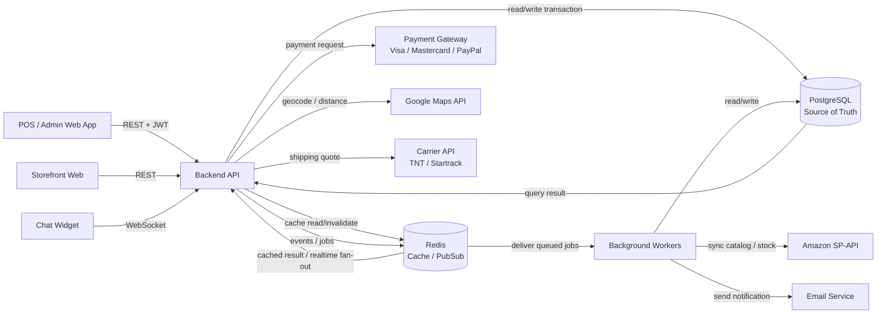
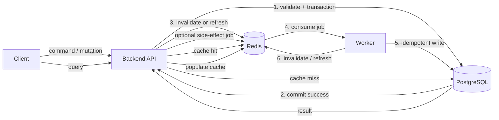
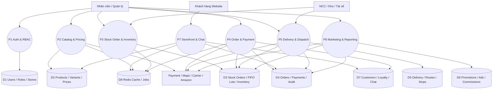
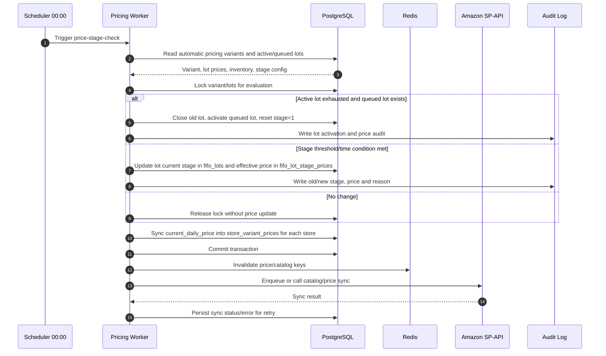
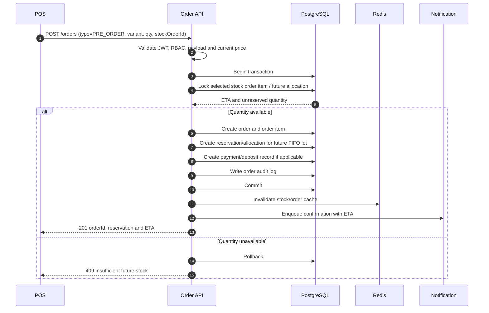
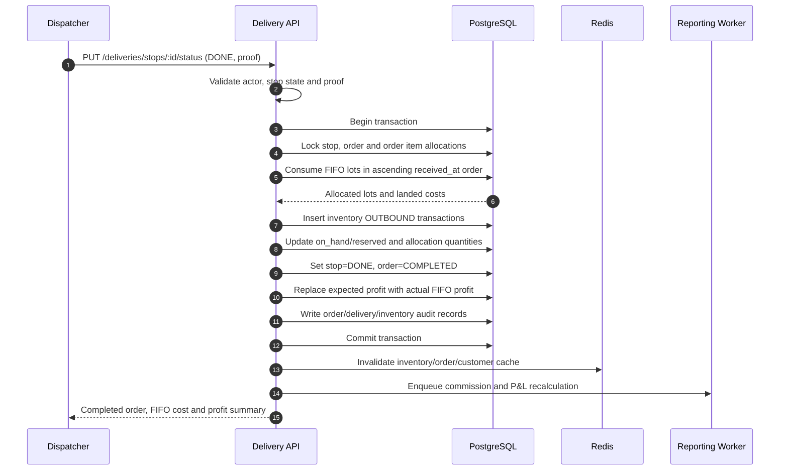

# THIẾT KẾ LUỒNG DỮ LIỆU & SEQUENCE DIAGRAM

**Dự án:** Hệ Thống Quản Lý Bán Hàng & Thương Mại Điện Tử Đa Chi Nhánh  
**Tài liệu liên quan:** [DATABASE_DESIGN.md](DATABASE_DESIGN.md), [API_SPEC.md](API_SPEC.md)  
**Phiên bản:** 1.0  
**Ngày cập nhật:** 07/09/2026  
**Phạm vi:** Module 1-6, gồm POS, kho, FIFO, delivery, storefront, marketing, báo cáo và live chat.

## 1. Mục tiêu và nguyên tắc

Thiết kế này mô tả dữ liệu đi qua hệ thống từ lúc phát sinh yêu cầu đến khi được lưu trữ, đồng bộ hoặc phát thông báo. Backend API là nơi điều phối duy nhất; PostgreSQL là nguồn dữ liệu chuẩn.

Các nguyên tắc bắt buộc:

1. **Business logic ở Backend:** Database chỉ lưu trữ, kiểm tra ràng buộc cơ bản và cung cấp transaction/locking.
2. **PostgreSQL là source of truth:** Redis chỉ chứa dữ liệu có thể tái tạo; không dùng Redis làm nguồn quyết định tồn kho, giá hoặc trạng thái đơn.
3. **Một nghiệp vụ nhiều bước dùng transaction:** Tạo đơn, giữ chỗ, nhập kho, xuất FIFO và hoàn tất giao hàng phải commit hoặc rollback toàn bộ.
4. **Mọi thay đổi quan trọng có audit:** Giá, đơn hàng, tồn kho, thanh toán, delivery và lợi nhuận phải truy nguyên được actor, thời điểm, giá trị trước/sau.
5. **Tích hợp ngoài có idempotency:** Webhook thanh toán, API vận chuyển và Amazon SP-API phải có khóa/idempotency key, retry có giới hạn và dead-letter/error log.

## 2. Kiến trúc luồng dữ liệu mức ngữ cảnh

### 2.1. Trách nhiệm các thành phần

| Thành phần | Vai trò | Không được làm |
| :--- | :--- | :--- |
| POS/Admin/Storefront | Nhập yêu cầu, hiển thị kết quả | Tự tính tồn kho chuẩn hoặc tự sửa trạng thái DB |
| Backend API | Xác thực, phân quyền, validation, nghiệp vụ, transaction | Gọi trực tiếp từ client đến PostgreSQL |
| PostgreSQL | Lưu dữ liệu nghiệp vụ, FK, unique/check, transaction | Chứa stored trigger/procedure nghiệp vụ |
| Redis | Cache catalog/price, invalidation, Pub/Sub/WebSocket fan-out, job queue | Quyết định tồn kho hoặc giá cuối cùng |
| Worker | Job định kỳ, đồng bộ ngoài, báo cáo, email | Bỏ qua idempotency hoặc audit |
| Hệ thống ngoài | Thanh toán, bản đồ, vận chuyển, Amazon, email | Được xem là nguồn dữ liệu nghiệp vụ nội bộ |

### 2.2. Quy tắc ghi cache và đồng bộ về PostgreSQL

Thiết kế này dùng **cache-aside**, không dùng Redis làm nơi ghi dữ liệu nghiệp vụ trước:

**Luồng ghi đồng bộ:** Client gửi command đến Backend API; API validate và ghi PostgreSQL trong transaction. Chỉ sau khi commit thành công, API mới invalidate hoặc refresh cache. Vì vậy cache không cần đường ghi ngược về PostgreSQL.

**Luồng ghi bất đồng bộ:** Nếu tác vụ cần xử lý nền, API ghi một job/event có `jobId`, `aggregateId`, `eventType` và `payloadVersion` vào queue Redis sau khi transaction nghiệp vụ đã commit. Worker đọc job, kiểm tra idempotency, ghi PostgreSQL, lưu trạng thái retry/error, rồi invalidate cache. Redis lúc này là hàng đợi tạm thời, không phải bản ghi chuẩn.

**Nếu ứng dụng hiện đang ghi dữ liệu nghiệp vụ trực tiếp vào Redis:** dữ liệu đó sẽ không tự động cập nhật về PostgreSQL vì không có cơ chế write-back mặc định. Cần chuyển điểm ghi về Backend API hoặc bổ sung Worker + job contract + retry/dead-letter + idempotency trước khi coi luồng đó là hợp lệ. Không dùng TTL, Pub/Sub hoặc cache invalidation để giả định dữ liệu đã được lưu vào PostgreSQL.

| Loại thao tác | Đường đi chuẩn | Redis bị lỗi |
| :--- | :--- | :--- |
| Tạo/sửa đơn, tồn kho, thanh toán | Client → API → PostgreSQL → invalidate Redis | Request lỗi hoặc retry; không ghi Redis thay thế |
| Đọc catalog/giá | API → Redis; cache miss → PostgreSQL → Redis | Đọc thẳng PostgreSQL |
| Đồng bộ nền/email/Amazon/báo cáo | API → PostgreSQL → queue Redis → Worker → PostgreSQL | Job phải được lưu ở durable queue khác hoặc báo lỗi |

## 3. DFD mức 1 theo miền nghiệp vụ

## 4. Luồng dữ liệu chính

### 4.1. Storefront: Postcode đến giá và giỏ hàng

1. Khách gọi `POST /api/storefront/resolve-postcode`.
2. Backend validate postcode, tra `postcodes` và `postcode_stores`, chọn store phục vụ chính.
3. Backend trả `storeId`, warehouse phục vụ, vùng giá và lưu `postcode/storeId` vào session/cookie an toàn.
4. Khi đọc catalog, Backend lấy đơn giá cố định trong ngày từ `store_variant_prices` theo `storeId` và `variantId` (fallback về giá Stage hiện tại của lô FIFO active nếu chưa cài giá riêng), lưu Redis cache theo khóa `catalog:{storeId}:{variantId}`.
5. Khi thêm giỏ hàng, Backend kiểm tra lại postcode, giá hiện hành từ `store_variant_prices`, promotion, VIP và khả dụng; không tin giá do client gửi.
6. Đổi mapping postcode, giá hoặc promotion phải invalidate các khóa cache liên quan.

### 4.2. Nhập container và tạo FIFO lot

1. Nhân viên tạo `stock_orders` và `stock_order_items`, trạng thái `DRAFT`.
2. Khi container cập bến, API nhận số lượng thực tế, phần thiếu/hỏng và landed cost.
3. Trong một transaction, Backend cập nhật trạng thái stock order, tạo `fifo_lots`, bảng giá 5-stage `fifo_lot_stage_prices`, tăng `warehouse_inventory` và ghi `inventory_transactions` loại `INBOUND`.
4. Pre-order đã giữ chỗ theo container được đối chiếu và chuyển sang allocation chờ xuất; không tự ý vượt số lượng thực nhận.
5. Worker invalidate tồn kho/giá, cập nhật các cảnh báo ROP và phát thông báo cho POS.

### 4.3. POS Order Now, Pre-order và Future Delivery

| Loại đơn | Nguồn cấp hàng | Tác động khi tạo đơn | Tác động khi giao |
| :--- | :--- | :--- | :--- |
| Order Now | FIFO lot đang active | Lock tồn, tăng reserved, tạo allocation | Xuất lot, giảm on-hand/reserved, chốt actual profit |
| Pre-order | Container/FIFO lot tương lai đã chọn | Tăng reserved của lô tương lai, không giảm on-hand hiện tại | Gán lot thực tế khi nhập, sau đó xuất và chốt profit |
| Future Delivery | Lot phục vụ theo ngày hẹn | Giữ reservation theo kế hoạch/ngày, không trừ available bán ngay nếu chưa đến thời điểm | Re-check capacity, chuyển sang outbound allocation và giao |

Không cho phép tạo reservation nếu số lượng khả dụng sau lock nhỏ hơn số lượng yêu cầu. Các thao tác kiểm tra và cập nhật phải dùng cùng transaction và row lock trên `warehouse_inventory` hoặc allocation tương ứng.

### 4.4. Delivery và hoàn tất FIFO

1. Order ở trạng thái đủ điều kiện giao được tạo `delivery_bookings`.
2. Điều phối chọn các booking, Backend lấy tọa độ đã chuẩn hóa, gọi Google Maps và tạo `delivery_routes`/`delivery_stops`.
3. Khi prepare, kho xác nhận số box và tạo outbound inventory transactions.
4. Khi stop chuyển `DONE`, Backend xác nhận proof/signature, đánh dấu order `COMPLETED`, tạo/hoàn tất `order_item_fifo_allocations`.
5. Actual cost lấy từ landed cost của các FIFO lot đã xuất; actual profit = net sales - actual FIFO cost - các khoản chi phí được quy định.
6. Nếu `COMEBACK`, không chốt completed; tạo return inbound/điều chỉnh reservation theo tình trạng hàng.

### 4.5. Thanh toán, loyalty và hoa hồng

- Payment intent được tạo với `idempotencyKey`; dữ liệu thẻ thô không lưu trong hệ thống.
- Gateway callback được xác thực, deduplicate theo transaction/reference và ghi `order_payments`.
- Điểm loyalty chỉ cộng theo chính sách khi order đạt trạng thái hợp lệ, không cộng lại khi callback retry.
- Commission chỉ đưa vào kỳ chốt khi order `COMPLETED`; hủy/đổi sau đó tạo adjustment thay vì sửa lịch sử đã chốt.

## 5. Sequence diagrams bắt buộc

### 5.1. Worker tự động chuyển giá 5 stage & Đồng bộ giá theo Cửa hàng

**Invariant:** Không invalidate cache trước khi transaction commit. Một SKU chỉ được một worker đánh giá tại một thời điểm; job retry không được tạo thêm audit hoặc thay đổi stage lần thứ hai.

### 5.2. Tạo Pre-order và giữ chỗ container

**Invariant:** Pre-order chỉ giữ chỗ trên nguồn hàng đã chọn và không làm giảm `on_hand` hiện tại. Nếu không có ETA hoặc reservation capacity, request phải thất bại rõ ràng.

### 5.3. Hoàn tất giao hàng và ghi nhận lợi nhuận FIFO

**Invariant:** Không đánh dấu `COMPLETED` nếu không đủ allocation thực tế. Actual profit chỉ được chốt từ lot đã xuất; không dùng landed cost dự kiến thay thế.

## 5.5. Quy tắc Quản lý Cache Hạt Mịn (Fine-Grained Cache Keys - #6)

Để tránh việc xóa toàn bộ cache khi chỉ có 1 sản phẩm/biến thể thay đổi (Cache Stampede), hệ thống quy định cấu trúc Cache Key hạt mịn và cơ chế **Entity-Level Invalidation**:

- **Cấu trúc Key quy chuẩn:**
  - Cache giá biến thể theo cửa hàng & lô: `price:{storeId}:{variantId}:{lotId}`
  - Cache tồn kho khả dụng kho: `stock:{warehouseId}:{variantId}`
  - Cache điểm thưởng khách hàng: `customer:loyalty:{customerId}`
  - Cache Lô FIFO đang Active: `lot:active:{warehouseId}:{variantId}`
  - Cache thông tin chi nhánh: `store:info:{storeId}`
- **Quy tắc Invalidation (Xóa cache có mục tiêu):**
  - Khi xuất/nhập kho biến thể $V$: Chỉ gửi lệnh `DEL stock:{warehouseId}:{V}`.
  - Khi cập nhật giá lô $L$ của biến thể $V$ ở cửa hàng $S$: Chỉ gửi lệnh `DEL price:{S}:{V}:{L}`.
  - Tuyệt đối KHÔNG dùng `FLUSHALL` hoặc xóa wildcard rộng (`price:*`) trên Production.

## 6. Luồng lỗi, retry và nhất quán

| Tình huống | Xử lý | Kết quả dữ liệu |
| :--- | :--- | :--- |
| Deadlock/lock timeout | Rollback, retry tối đa theo backoff | Không có partial update |
| Payment callback trùng | Kiểm tra gateway reference/idempotency key | Một payment, một loyalty event |
| Maps/Carrier timeout | Timeout ngắn, retry có giới hạn; cho phép manual review | Booking chưa được xác nhận nếu thiếu quote/route |
| Amazon sync lỗi | Lưu sync status và retry qua queue | Giá nội bộ vẫn đúng; không rollback nghiệp vụ nội bộ |
| Redis unavailable | Bỏ qua cache, đọc PostgreSQL; queue realtime có thể trễ | Không mất dữ liệu chuẩn |
| Worker chạy lại | Dùng job key + audit deduplication | Không nhảy stage/chốt profit hai lần |
| Giao hàng thất bại | Chuyển `COMEBACK`, tạo quy trình return/inspection | Không ghi nhận completed profit |

## 7. Bảo mật, Kiểm soát Truy cập & Monitoring Theo Luồng

- **Rate-Limiting Middleware (#3):** Mọi request trước khi vào Controller đều phải qua Middleware kiểm tra Token Bucket trên Redis theo Client IP/User ID. Nếu vượt giới hạn, Middleware trả về ngay HTTP 429 mà không truy vấn DB.
- **Audit Log Encryption (#4):** Interceptor tự động mã hóa 2 chiều payload `oldData` và `newData` sử dụng thuật toán AES-256-GCM trước khi ghi nhận vào `order_audit_logs` / `system_audit_logs`.
- **System Health & Readiness Monitoring (#8):** Load Balancer / Orchestrator định kỳ gọi `GET /api/healthz` (liveness) và `GET /api/readyz` (readiness). Nếu `readyz` thất bại (ví dụ: mất kết nối DB/Redis), node đó sẽ tự động bị rút khỏi luồng điều hướng traffic mà không cần restart service.
- Mọi REST API nội bộ yêu cầu Bearer token; Backend kiểm tra role và `store_id` trước khi đọc/ghi.
- Client không được truyền hoặc quyết định `actualCost`, `actualProfit`, `availableStock`, `role`, `storeId` hay trạng thái cuối của order.
- Postcode, địa chỉ, số điện thoại và email được validate ở boundary; log không ghi password, token, dữ liệu thẻ hoặc thông tin nhạy cảm không cần thiết.
- WebSocket phải xác thực session token khi `join_session`; chỉ thành viên của session mới nhận được message.
- Audit log phải gắn `actorId`, `requestId`, `entityType`, `entityId`, `action`, `before`, `after`, `createdAt`.

## 8. Danh sách kiểm thử chấp nhận

1. Hai request POS đồng thời không làm `available` âm và không tạo reservation vượt số lượng.
2. Worker giá chạy lặp lại không tạo duplicate audit và chỉ chuyển stage một lần.
3. Nhập container tạo đúng FIFO lot, xử lý thiếu/hỏng và tự đối chiếu reservation pre-order.
4. Xuất hàng từ nhiều lot tính đúng actual FIFO cost và actual profit.
5. `COMEBACK`, cancel và exchange không để lại reserved quantity hoặc commission sai.
6. Postcode chưa resolve không thể xem giá thực hoặc checkout.
7. Payment retry không nhân đôi payment, loyalty points hoặc order completion.
8. Redis, Maps, Carrier hoặc Amazon lỗi không làm mất dữ liệu đã commit trong PostgreSQL.
9. RBAC chặn người dùng truy cập dữ liệu ngoài store scope.
10. Chat chỉ phát message cho đúng session và chịu được reconnect mà không nhân đôi message.

11. Chat guest không yêu cầu authentication: public API tạo `chat_sessions` với
    `participant_type=GUEST`, `customer_id=NULL`; `session_token` là credential giới
    hạn cho đúng session. CS_AGENT vẫn bắt buộc JWT và store scope.

## 9. Phạm vi triển khai tiếp theo

1. Chuyển các invariant ở mục 4-6 thành service-level tests và integration tests.
2. Tạo outbox/job table hoặc queue contract cho các side effect sau commit.
3. Bổ sung OpenAPI schema cho `idempotencyKey`, error code, reservation và FIFO allocation.
4. Tạo migration/index tương ứng sau khi chốt tên bảng reservation/future allocation trong database design.