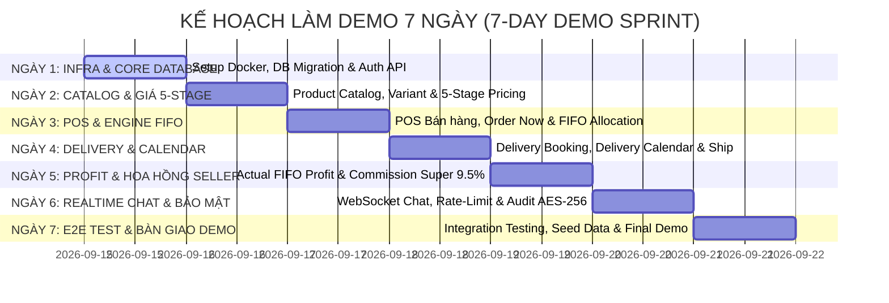

# 🚀 KẾ HOẠCH TRIỂN KHAI BẢN DEMO 7 NGÀY (7-DAY DEMO IMPLEMENTATION PLAN)

**Dự án:** Hệ Thống Quản Lý Bán Hàng & Thương Mại Điện Tử Đa Chi Nhánh  
**Mục tiêu:** Xây dựng thành công bản **Demo khả thi tối thiểu (Working Demo / MVP)** hoàn chỉnh luồng nghiệp vụ end-to-end trong vòng **7 ngày** (từ Ngày 1 đến Ngày 7).  
**Căn cứ thiết kế:** [AGENTS.md](../AGENTS.md), [API_SPEC.md](../API_SPEC.md), [DATABASE_DESIGN.md](../DATABASE_DESIGN.md), [DATA_FLOW_DESIGN.md](../DATA_FLOW_DESIGN.md), [SDLC_AI_SKILLS.md](../SDLC_AI_SKILLS.md), và các tài liệu đặc tả trong [docs/plans/](./).  
**Triết lý kiến trúc:** **Backend-Driven Business Logic** — Database thuần túy lưu trữ dữ liệu (Data Persistence), 100% logic và xử lý nghiệp vụ được thực hiện tại tầng Backend Application Services.

---

## 🗺️ LỘ TRÌNH TRIỂN KHAI 7 NGÀY (7-DAY SPRINT TIMELINE)

---

## 📋 CHI TIẾT CÔNG VIỆC THEO TỪNG NGÀY (DAY-BY-DAY ACTION PLAN)

### NGÀY 1: Hạ Tầng Core, Database Migration & Auth / Health API
- [ ] **Khởi tạo Infra:** Cấu hình Docker Compose (PostgreSQL 16, Redis 7.2).
- [ ] **Database Migration:** Chạy SQL Migration tạo toàn bộ 28+ bảng dữ liệu (Core, Auth, Products, Orders, Inventory, Delivery, Audit) theo DDL trong `DATABASE_DESIGN.md`.
- [ ] **Core Setup & Health Checks (#8):** Tạo ứng dụng Backend (FastAPI / NestJS) kèm endpoint `GET /api/healthz` và `GET /api/readyz`.
- [ ] **Auth & RBAC:** Triển khai API `/api/auth/login`, `/api/auth/me`, JWT Bearer token và Middleware phân quyền theo `store_id`.
- **Kết quả đầu ra Ngày 1:** DB kết nối ổn định, API Auth & Health Check hoạt động 100%.

### NGÀY 2: Danh Mục Sản Phẩm, Biến Thể, Postcode & Engine Giá 5-Stage
- [ ] **Stores & Postcodes:** Triển khai API danh sách Cửa hàng `/api/stores`, Kho hàng `/api/warehouses` và tra cứu Postcode `/api/postcodes/lookup`.
- [ ] **Product Catalog:** API CRUD Sản phẩm cha (Parent), Danh mục 4 nhóm (Living, Dining, Bedroom, Outdoor) và Biến thể con (Variants).
- [ ] **Engine Giá 5-Stage:** Viết Worker/Cron job quét tồn kho & thời gian tồn để tự động chuyển Stage giá (Stage 1 -> Stage 5).
- [ ] **Landed Cost & Stock Order:** API tính Landed Cost (giá mua + cước cont CBM) và công cụ tính giá bán mục tiêu.
- **Kết quả đầu ra Ngày 2:** Catalog hiển thị chuẩn giá 5-stage theo chi nhánh/kho.

### NGÀY 3: POS Bán Hàng & Engine Quản Lý Tồn Kho FIFO
- [ ] **Inventory & Lô FIFO:** Triển khai quản lý Lô hàng FIFO (`fifo_lots`), Row-Level Locking (`FOR UPDATE`) cập nhật `warehouse_inventory`.
- [ ] **POS Terminal API:** API POS bán hàng đa tab (`/api/orders`), hỗ trợ đơn Order Now (giao ngay) vs Pre-Order (giữ chỗ cont hàng).
- [ ] **Giữ chỗ Tồn kho:** Đảm bảo `available_quantity` không bị âm khi xử lý nhiều đơn hàng đồng thời.
- **Kết quả đầu ra Ngày 3:** Màn hình POS tạo đơn thành công, giữ chỗ tồn kho chuẩn xác.

### NGÀY 4: Điều phối Giao hàng, Delivery Calendar & Phí Vận Chuyển
- [ ] **Delivery Booking:** Cơ chế trừ tồn khả dụng theo ngày hẹn giao tương lai.
- [ ] **Delivery Calendar API:** API hiển thị Lịch giao hàng Delivery Calendar (ngày/tuần/tháng) và thông tin đơn đặc biệt (vác lầu, lắp ráp).
- [ ] **Tính Phí Vận Chuyển:** Tính cước giao hàng theo khoảng cách km & dịch vụ TNT/Startrack.
- **Kết quả đầu ra Ngày 4:** Luồng đặt lịch giao hàng hoạt động, hiển thị đúng trên Delivery Calendar.

### NGÀY 5: Lợi Nhuận Thực Tế FIFO, Hoa Hồng Seller & Marketing
- [ ] **Actual FIFO Profit Engine:** Chốt Lợi nhuận Thực tế khi đơn hàng chuyển `COMPLETED` dựa trên `unit_landed_cost` thực tế của lô FIFO đã xuất; xử lý lại khi `COMEBACK`/hủy đơn.
- [ ] **Seller Commission Engine:** API tính hoa hồng nhân viên bán hàng theo KPI doanh số/giờ vượt định mức, tự động trích lập Hưu bổng Úc (Superannuation 9.5%).
- [ ] **Marketing & Combo Sales:** API tạo Combo gói sản phẩm (`product_combos`) và gợi ý Cross-sell.
- **Kết quả đầu ra Ngày 5:** Báo cáo lợi nhuận FIFO thực tế và bảng hoa hồng Seller hiển thị chính xác.

### NGÀY 6: Realtime WebSocket Live Chat, Bảo Mật & Cache Hạt Mịn
- [ ] **WebSocket Live Chat:** Gateway `ws://localhost:3000` kết nối Chat thời gian thực giữa Khách vãng lai và Bàn CSKH Admin.
- [ ] **Rate-Limiting Middleware (#3):** Token Bucket Redis kiểm soát lưu lượng, trả về HTTP 429 nếu vượt ngưỡng.
- [ ] **Audit Encryption (#4):** Interceptor mã hóa 2 chiều AES-256-GCM các trường payload `old_data_encrypted` và `new_data_encrypted` trước khi ghi DB.
- [ ] **Fine-Grained Cache (#6) & Doc-Sync (#10):** Cấu hình Cache Key hạt mịn (`price:{storeId}:{variantId}:{lotId}`) và script `generate_openapi.py` tự động xuất `openapi.json`.
- **Kết quả đầu ra Ngày 6:** Live Chat thông suốt, hệ thống được bảo mật và tự động hóa tài liệu.

### NGÀY 7: Kiểm Thử Toàn Trình (E2E Test), Data Seeding & Demo Readiness
- [ ] **Data Seeding:** Chạy script nạp dữ liệu mẫu (Stores, Warehouses, Products, Variants, FIFO Lots, Users).
- [ ] **E2E Integration Test:** Chạy kịch bản kiểm thử toàn trình từ: Đặt hàng POS -> Giữ chỗ tồn -> Giao hàng -> Trừ lô FIFO -> Chốt profit -> Tính hoa hồng Seller -> Chat CSKH.
- [ ] **Demo Review:** Kiểm tra tổng thể SLA response time ($< 200\text{ms}$) và sẵn sàng thuyết minh/demo.
- **Kết quả đầu ra Ngày 7:** Bản **Demo hoàn chỉnh 100%** sẵn sàng trình chiếu.

---

## 🎯 MA TRẬN KỊCH BẢN KHI DEMO (DEMO SCENARIO MATRIX)

| Bước | Kịch bản Demo (Demo Workflow Step) | Kết quả hiển thị khi Demo |
| :-: | :--- | :--- |
| **1** | Đăng nhập tài khoản Nhân viên POS chi nhánh Perth | Trả về JWT token, hiển thị thông tin User & danh sách Cửa hàng/Kho phụ trách. |
| **2** | Khách vãng lai truy cập Web Storefront & nhập Postcode `6000` | Mở khóa bảng giá chi nhánh Perth, hiển thị phí ship 45 AUD. |
| **3** | Thu ngân tạo đơn hàng POS mua Sản phẩm (King Bed & Sofa) | Trừ `available_quantity` tại Kho Perth, tạo bản ghi giữ chỗ lô FIFO. |
| **4** | Đặt lịch giao hàng vào Delivery Calendar tuần tới | Bản ghi hiển thị trên Lịch giao hàng, lưu ghi chú đặc biệt (vác lầu). |
| **5** | Xác nhận giao hàng thành công (`COMPLETED`) | Hệ thống khấu trừ chính xác lô FIFO cũ nhất, chốt Lợi nhuận Thực tế. |
| **6** | Xem Báo cáo Hoa hồng Nhân viên Bán hàng | Tự động tính doanh số vượt KPI/giờ và trích Superannuation 9.5%. |
| **7** | Khách gửi tin nhắn trên Web Chat | Tin nhắn lập tức xuất hiện trên bàn làm việc của CSKH Agent qua WebSocket. |
| **8** | Kiểm tra Log Bảo mật trong PostgreSQL | Dữ liệu audit log hiển thị dưới dạng chuỗi mã hóa AES-256 an toàn. |

---

## 🛡️ TIÊU CHUẨN NGHIỆM THU NGÀY 7 (QUALITY GATE FOR DEMO)

- [x] Tất cả 11 phân hệ & 6 modules có tính năng chính hoạt động trơn tru.
- [x] Không bị lỗi sập app (crash) hoặc lỗi 500 khi thao tác trên màn hình Demo.
- [x] Có dữ liệu mẫu phong phú thể hiện rõ bài toán giá 5-stage, FIFO landed cost, hoa hồng hưu bổng Úc và giao hàng theo Postcode.

---

## 🚫 CÁC HẠNG MỤC TẠM THỜI CHƯA ĐƯA VÀO BẢN DEMO 7 NGÀY (EXCLUDED / OUT OF SCOPE FOR 7-DAY DEMO)

Để đảm bảo mục tiêu tập trung hoàn thành bản Demo khả thi (MVP) chạy trơn tru trong 7 ngày, các hạng mục tính năng sau đây **tạm thời chưa đưa vào phạm vi triển khai của bản Demo 7 ngày** (hoặc được giả lập đơn giản):

1. **Phân hệ Chấm Công & Quản Trị Nhân Sự (Timesheets, Attendance & Full HRM):**
   - *Quyết định:* **LOẠI BỎ HOÀN TOÀN KHỎI DỰ ÁN.** Hệ thống không triển khai tính năng chấm công ca làm việc (`sales_shifts`), điểm danh, sơ yếu lý lịch hay quản lý hợp đồng nhân sự.
   - *Phạm vi giữ lại:* Chỉ giữ lại duy nhất **Engine tính Hoa hồng Seller (`sales_commissions`)** để tự động tính thưởng theo KPI doanh số bán hàng vượt định mức và trích lập Hưu bổng Úc (Superannuation 9.5%).

2. **Ứng Dụng Di Động Dành Cho Tài Xế / Shipper (Shipper Native Mobile App):**
   - *Quyết định:* **LOẠI BỎ HOÀN TOÀN KHỎI DỰ ÁN.** Không phát triển ứng dụng di động (iOS/Android) cho tài xế.
   - *Phạm vi thay thế:* Mọi thao tác điều phối giao hàng, theo dõi lịch Delivery Calendar và cập nhật trạng thái giao hàng/bằng chứng giao hàng (Proof of Delivery) được thực hiện 100% trên giao diện Web App của Điều phối viên Dispatcher / POS Admin.

3. **Tích Hợp API Sàn Thương Mại Điện Tử Quốc Tế (Live Amazon / Shopify API Sync):**
   - *Lý do loại trừ:* Cần tài khoản Developer Enterprise thật và thời gian xét duyệt API từ Amazon/Shopify.
   - *Xử lý trong Demo:* Sử dụng Mock Worker giả lập phản hồi sync tồn kho/giá từ Amazon Seller API.

4. **Kết Nối Cổng Thanh Toán Thẻ Trực Tuyến Thực Tế (Live Visa/Mastercard/Paypal Gateway):**
   - *Lý do loại trừ:* Tránh phụ thuộc vào Cổng thanh toán thật và thủ tục Merchant ID.
   - *Xử lý trong Demo:* Sử dụng Mock Payment Gateway hỗ trợ cơ chế Idempotency Key giả lập thanh toán thành công/thất bại instant.

5. **Định Vị GPS Vệ Tinh Trực Tiếp & Routing Bản Đồ Thời Gian Thực (Live GPS Tracking Engine):**
   - *Lý do loại trừ:* Phụ thuộc thiết bị phần cứng GPS gắn trên xe tải thật.
   - *Xử lý trong Demo:* Tính khoảng cách km giao hàng và cước phí theo bảng quy đổi khoảng cách Postcode / Mock Google Distance Matrix API.

6. **Hệ Thống Phân Tích Báo Cáo Chuyên Sâu (OLAP Data Warehouse & BI Dashboard):**
   - *Lý do loại trừ:* Tốn thời gian setup ETL Pipeline (Airflow/ClickHouse) trong thời hạn 7 ngày.
   - *Xử lý trong Demo:* Thực hiện các truy vấn báo cáo SQL trực tiếp (Real-time SQL aggregations) trên PostgreSQL phục vụ các báo cáo Doanh số, Lợi nhuận FIFO và Hoa hồng.

